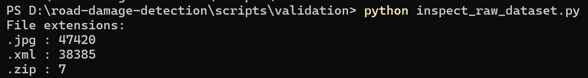

# Development Progress

## 2026/08/20 - Raw dataset inspection

### Goal

Inspect the original RDD2022 dataset before preprocessing

先確認RDD2022原始資料有哪些檔案格式

### Checks 

1. Count file extensions

### Script 

`scripts/validation/inspect_raw_dataset.py`

### Result

-`.jpg` : 47420

-`.xml` : 38385

-`.zip` : 7 

### ScreenShot

